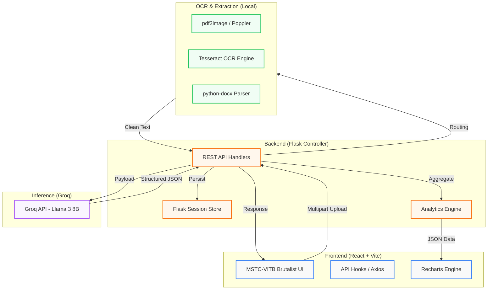
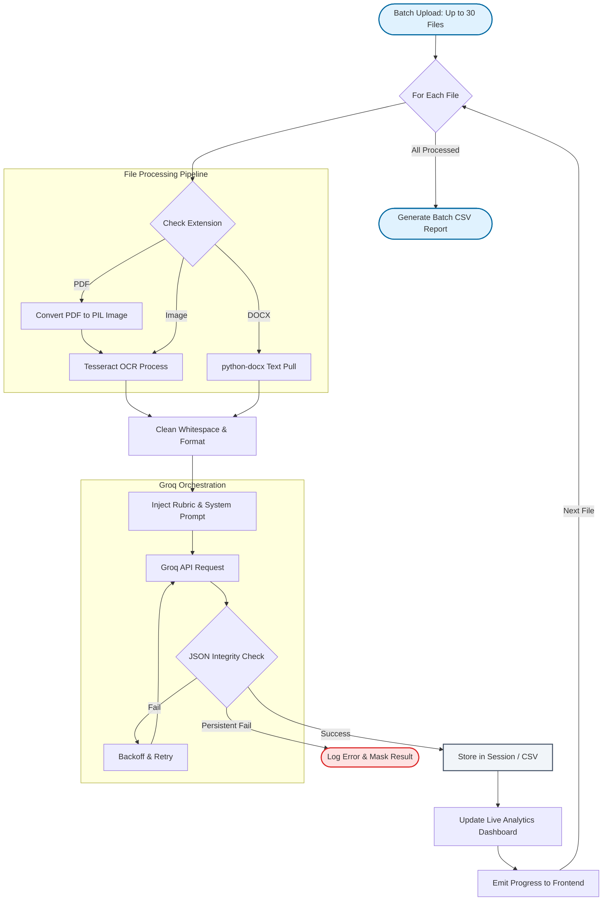
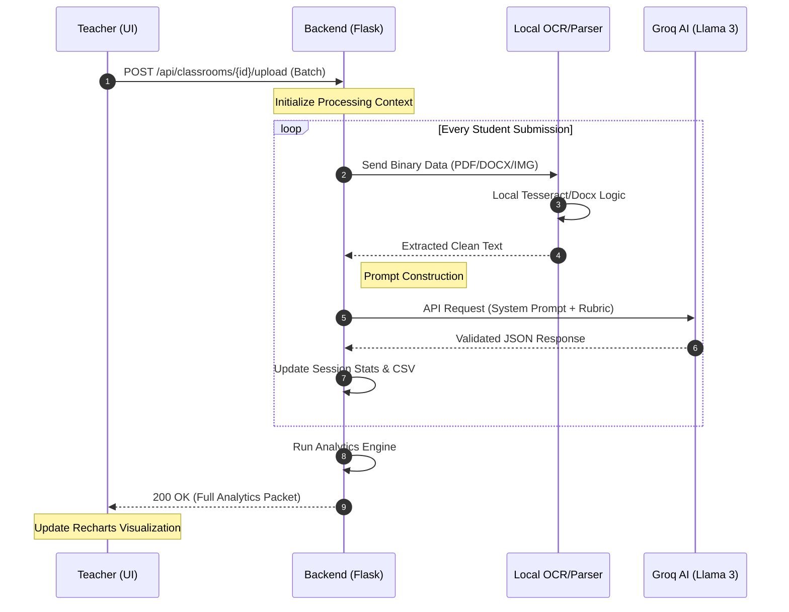
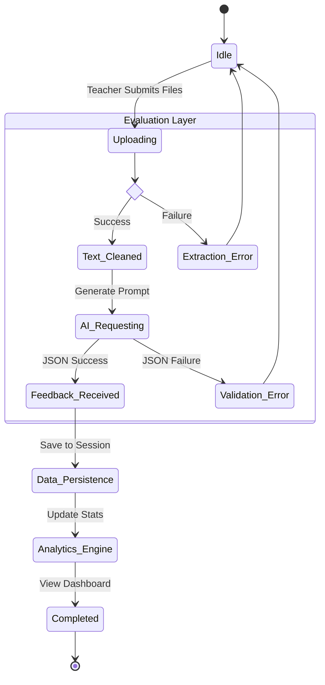
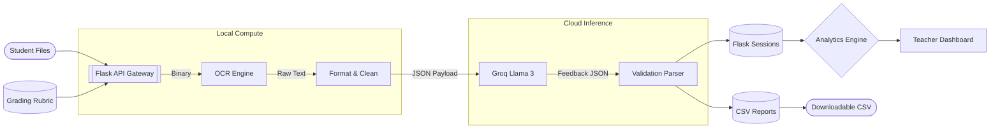

# Teacher Copilot - AI Feedback Engine

A full-stack AI-powered assignment evaluation system for teachers. Upload student assignments (PDF, DOCX, images), extract text locally using OCR, and get structured AI feedback via Groq LLM.

## 🎯 Features

- **Local OCR Processing** - No paid OCR APIs. Uses pdf2image, pytesseract, and python-docx
- **AI Evaluation** - Powered by Groq LLM (llama3-8b) - replaces paid Google Vision
- **Multiple File Formats** - PDF, DOCX, PNG, JPG
- **Brutalist Modern UI** - Based on MSTC-VITB design system
- **Real-time Feedback** - Score, mistakes, and suggestions
- **Classroom Workflow** - Manage classes, batch upload, class analytics
- **Batch Evaluation** - Evaluate multiple assignments (up to 30 at once)
- **Analytics Dashboard** - Charts, insights, student rankings
- **CSV Reporting** - Download evaluation reports (merged from original Edu-Evaluator)
- **Session Management** - Flask sessions with filesystem storage

## 📁 Project Structure

```
Edu-Evaluator-main/
├── Backend/                   # Flask API
│   ├── app.py                 # Main Flask app with merged features
│   ├── ocr.py                 # Text extraction (pdf2image, pytesseract)
│   ├── llm.py                 # Groq LLM integration
│   ├── routes.py              # Single evaluation API endpoints
│   ├── classroom_models.py    # Classroom data models & storage
│   ├── classroom_routes.py    # Classroom workflow API endpoints
│   ├── analytics_engine.py    # Class analytics & insights
│   ├── uploads/               # Temporary file storage
│   ├── flask_sessions/        # Session storage
│   ├── student_scores.csv     # Evaluation reports
│   └── requirements.txt
├── Frontend/                  # React + Vite
│   ├── src/
│   │   ├── pages/           # Page components
│   │   │   ├── Classrooms.jsx           # List all classrooms
│   │   │   ├── ClassroomDetail.jsx      # Single classroom view
│   │   │   ├── ClassroomUpload.jsx      # Batch upload
│   │   │   ├── ClassroomAnalytics.jsx   # Analytics dashboard
│   │   │   └── ... (other pages)
│   │   ├── components/      # Reusable components
│   │   └── ...
│   └── package.json
└── README.md
```

## 🏗️ Technical Architecture

### 1. System Component Overview
This diagram illustrates how the React frontend interacts with the Python/Flask backend and the distribution of tasks between local OCR processing and high-speed LLM inference via Groq.



### 2. Multi-Format Batch Evaluation Flow
Detailed logic for handling multiple student filenames concurrently, extracting text based on file extensions, and performing AI-driven evaluation.



### 3. Systematic Interaction (Sequence Diagram)
This diagram maps the synchronous and asynchronous triggers between the Teacher UI, the Local Processing worker, and the Groq Inference Engine.



### 4. Assignment Lifecycle (State Machine)
Visualizing the state transitions of a student submission from 'Raw File' to 'Evaluated Metric'.



### 5. High-Level Dataflow (DFD)
Tracing the transformation of data from physical submission to analytical insights.



## 🚀 Setup Instructions

### Prerequisites

1. **Python 3.8+** - [Download Python](https://www.python.org/downloads/)
2. **Node.js 18+** - [Download Node](https://nodejs.org/)
3. **Tesseract OCR** - Local OCR engine

#### Install Tesseract OCR

**Windows:**
1. Download from [tesseract-ocr GitHub releases](https://github.com/UB-Mannheim/tesseract/wiki)
2. Install to `C:\Program Files\Tesseract-OCR`
3. Add to PATH: `C:\Program Files\Tesseract-OCR`

**macOS:**
```bash
brew install tesseract
```

**Ubuntu/Debian:**
```bash
sudo apt-get install tesseract-ocr poppler-utils
```

#### Install Poppler (for PDF conversion)

**Windows:**
1. Download from [poppler Windows releases](https://github.com/oschwartz10612/poppler-windows/releases)
2. Extract to `C:\Program Files\poppler\Library\bin`
3. Add to PATH

**macOS:**
```bash
brew install poppler
```

**Ubuntu/Debian:**
```bash
sudo apt-get install poppler-utils
```

### Backend Setup

1. **Navigate to Backend folder:**
```bash
cd Backend
```

2. **Create virtual environment:**
```bash
python -m venv venv

# Windows
venv\Scripts\activate

# macOS/Linux
source venv/bin/activate
```

3. **Install dependencies:**
```bash
pip install -r requirements.txt
```

4. **Create .env file:**
```bash
cp .env.example .env
```

5. **Edit .env with your Groq API key:**
```env
GROQ_API_KEY=your_groq_api_key_here
FLASK_ENV=development
FLASK_DEBUG=True
PORT=5000
```

Get your Groq API key at: https://console.groq.com

6. **Run Flask server:**
```bash
python app.py
```

Server will start at `http://localhost:5000`

### Frontend Setup

1. **Navigate to Frontend folder (in a new terminal):**
```bash
cd Frontend
```

2. **Install dependencies:**
```bash
npm install
```

3. **Run development server:**
```bash
npm run dev
```

Frontend will start at `http://localhost:5173`

## 🔌 API Endpoints

### POST /api/evaluate
Evaluate a single assignment file.

**Request:**
- Content-Type: `multipart/form-data`
- Fields:
  - `file`: The assignment file (PDF, DOCX, PNG, JPG)
  - `assignment_name`: (optional) Name of assignment
  - `subject`: (optional) Subject area

**Response:**
```json
{
  "success": true,
  "data": {
    "score": 87,
    "feedback": "Great understanding of concepts...",
    "mistakes": ["Error 1", "Error 2"],
    "suggestions": ["Suggestion 1", "Suggestion 2"],
    "assignment_name": "Math Quiz #5",
    "subject": "mathematics"
  },
  "message": "Evaluation completed successfully"
}
```

### POST /api/batch-evaluate
Evaluate multiple files.

**Request:**
- Content-Type: `multipart/form-data`
- Fields:
  - `files[]`: Multiple files
  - `assignment_name`: (optional) Batch name

### GET /api/report
Download CSV report of all evaluations.

**Response:**
- CSV file download

### GET /api/report/data
Get evaluation report data as JSON.

**Response:**
```json
{
  "success": true,
  "data": [...],
  "total_records": 10
}
```

### GET /api/health
Health check endpoint.

### Classroom Workflow Endpoints

#### POST /api/classrooms
Create a new classroom.

**Request:**
```json
{
  "name": "10th Grade Math",
  "subject": "Mathematics",
  "assignment_title": "Quadratic Equations Quiz"
}
```

#### GET /api/classrooms
List all classrooms with stats.

#### GET /api/classrooms/{id}
Get classroom details.

#### POST /api/classrooms/{id}/upload
Batch upload student assignments.

**Request:**
- Content-Type: `multipart/form-data`
- Fields:
  - `files[]`: Multiple PDF/DOCX/image files

**Response:**
```json
{
  "success": true,
  "data": {
    "processed": 30,
    "failed": 0,
    "analytics": {
      "overview": {...},
      "score_distribution": [...],
      "common_mistakes": [...]
    }
  }
}
```

#### GET /api/classrooms/{id}/analytics
Get full classroom analytics with charts data.

**Response:**
```json
{
  "success": true,
  "data": {
    "overview": {...},
    "score_distribution": [...],
    "pass_fail_ratio": {...},
    "common_mistakes": [...],
    "weakest_concepts": [...],
    "student_ranking": [...],
    "class_insight": "AI-generated summary..."
  }
}
```

#### GET /api/classrooms/{id}/submissions
List all student submissions.

## 🛠️ Tech Stack

### Backend (Merged with Edu-Evaluator)
- **Flask** - Python web framework
- **Flask-Login** - User session management
- **Flask-Bcrypt** - Password hashing
- **Flask-Session** - Server-side sessions
- **pdf2image** - PDF to image conversion (from existing backend)
- **pytesseract** - OCR engine (local, no paid APIs)
- **python-docx** - DOCX parsing
- **groq** - LLM API client (replaces paid Google Gemini)
- **flask-cors** - CORS handling
- **pandas** - CSV reporting (from existing backend)

### Frontend
- **React 18** - UI library
- **Vite** - Build tool
- **Tailwind CSS** - Styling
- **Framer Motion** - Animations
- **Lucide React** - Icons
- **Recharts** - Charts (for Insights page)

## 📸 Screenshots

**Upload Page:**
- Drag & drop file upload
- Assignment metadata form
- Real-time progress tracking

**Results Page:**
- Score display (0-100)
- AI feedback summary
- Mistakes list
- Improvement suggestions

**Classroom Workflow:**

*Classrooms Page:*
- Card layout with classroom list
- Quick stats (students, average score)
- Create new classroom modal

*Batch Upload:*
- Drag & drop multiple files
- Upload up to 30 assignments at once
- Real-time progress for each file
- Student name extracted from filename

*Analytics Dashboard:*
- Bar chart: Score distribution
- Pie chart: Pass vs Fail ratio
- Common mistakes list
- Weakest concepts
- AI-generated class insight
- Student rankings table

## 🔒 Privacy & Security

- All OCR processing is local - no external OCR APIs
- Files are temporarily stored and auto-deleted after processing
- No student data is retained on the server
- Groq API calls do not store your data

## 🐛 Troubleshooting

### "Tesseract not found" error
- Ensure Tesseract is installed and added to PATH
- On Windows, check `C:\Program Files\Tesseract-OCR\tesseract.exe` exists

### "Poppler not found" error (PDF processing)
- Install poppler-utils
- On Windows, ensure poppler bin directory is in PATH

### CORS errors
- Ensure Flask server is running on port 5000
- Check CORS is enabled in `app.py`

### LLM not responding
- Verify `GROQ_API_KEY` is set in `.env`
- Check your Groq dashboard for API usage limits

## 📝 License

MIT License - Feel free to use for educational purposes.

## 🤝 Contributing

Contributions welcome! This is an educational project for hackathons and learning.

---

Built with ❤️ for teachers everywhere.
